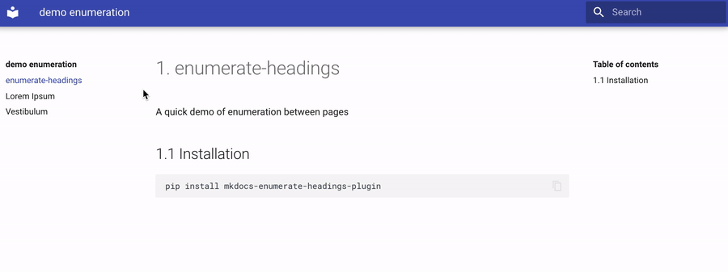

[](https://github.com/timvink/mkdocs-enumerate-headings-plugin/actions)


[](https://codecov.io/gh/timvink/mkdocs-enumerate-headings-plugin)


# mkdocs-enumerate-headings-plugin

[MkDocs](https://www.mkdocs.org/) Plugin to enumerate the headings (h1-h6) across site pages

## Features :star2:

- Automatically number all headings and give each page an sequential chapter number
- Great for writing (technical) reports
- Compatible with `plugins` like [awesome-pages](https://github.com/lukasgeiter/mkdocs-awesome-pages-plugin) and [monorepo](https://github.com/spotify/mkdocs-monorepo-plugin)
- Compatible with `markdown_extensions` like [pymdownx.snippets](https://facelessuser.github.io/pymdown-extensions/extensions/snippets/)
- Compatible with themes like [mkdocs-material](https://github.com/squidfunk/mkdocs-material)
- Easy to customize styling through CSS



## Setup

Install the plugin using `pip`:

```bash
pip3 install mkdocs-enumerate-headings-plugin
```

Next, add the following lines to your `mkdocs.yml`:

```yml
plugins:
  - search
  - enumerate-headings
```

> If you have no `plugins` entry in your config file yet, you'll likely also want to add the `search` plugin. MkDocs enables it by default if there is no `plugins` entry set.

## Usage

`enumerate-headings` will increment the chapter number for each new page (in the order they appear in the navigation) and enumerate all subheadings.

There is only one requirement: make sure each markdown page starts with a level 1 header (see [how to write markdown headers](https://daringfireball.net/projects/markdown/syntax#header)). Some MkDocs themes will handle this for your automatically, inserting the page title as a heading 1 if you do not specify one. If a heading 1 is still missing, you'll get a helpful error.

Pages with multiple level 1 headings are allowed and the chapter numbers will increment accordingly.

> Note this plugin does not affect your markdown files, only the rendered HTML.

### Styling

All heading numbers are wrapped in `<span class='enumerate-headings-plugins'></span>` and can be styled using CSS. See [customizing a MkDocs theme](https://www.mkdocs.org/user-guide/styling-your-docs/#customizing-a-theme) on how to add an CSS to your theme.

As an example you can make the numbering lighter than the heading title by saving the CSS snippet below to a file and adding it to your MkDocs site using the [extra_css](https://www.mkdocs.org/user-guide/configuration/#extra_css) setting in your `mkdocs.yml` file.

```css
/* Extra CSS for mkdocs-enumerate-headings-plugin */ 
.enumerate-headings-plugins {
  /* 100% is baseline so 250% is a lot lighter */
  filter: brightness(250%);
}
```

## Options

You can customize the plugin by setting options in `mkdocs.yml`:

```yml
plugins:
    - enumerate-headings:
        toc_depth: 0
        strict: true
```

- **`toc_depth`** (default `0`): Up to which level the table of contents should be enumerated as well. Default is 0, which means the TOC is not enumerated at all. Max is 6 (showing all enumeration)
- **`strict`** (default `true`): Raise errors instead of warnings when first heading on a page is not a level one heading (single `#`) and your MkDocs theme has not inserted the page title as a heading 1 for you. Note that in `strict: false` mode the heading numbers might be incorrect between pages and before and after a level 1 heading.

## Contributing

Contributions are very welcome! Please read [CONTRIBUTING.md](CONTRIBUTING.md) before putting in any work.

Credits: This plugin was inspired by [ignorantshr/mkdocs-add-number-plugin](https://github.com/ignorantshr/mkdocs-add-number-plugin), which focuses on enumerating single selected pages.
